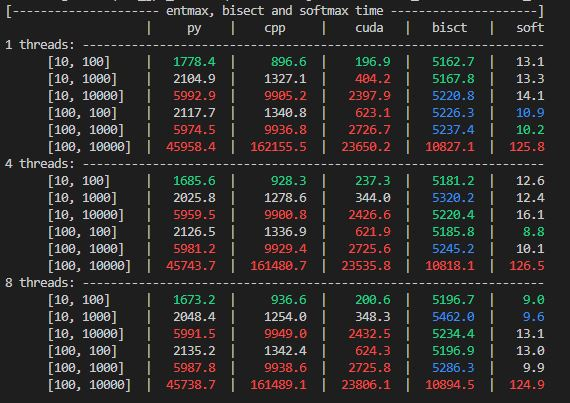

## Efficient localization of sparsemax mechanisms on GPU

This is a web link to my general notion map, where i store the read articles and a task list:
https://trite-eocursor-08b.notion.site/Thesis-Home-1da7ccfd5f0346068f0e863910ea3bbe

# Most recent benchmark results: 

